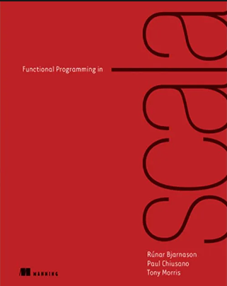

  

# Functional programming in Scala

[Official hints, notes and exercises](https://github.com/fpinscala/fpinscala/tree/first-edition)

[Book](https://www.manning.com/books/functional-programming-in-scala)